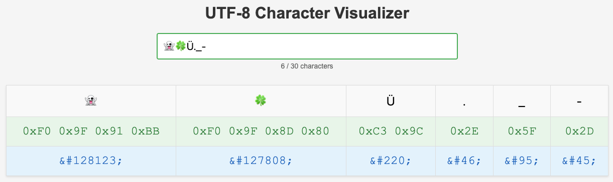

# UTF-8 Visualizer

A simple web tool that displays UTF-8 codes and HTML entities for any text input.

## Usage

Open `index.html` in your browser, or visit the live site at: https://donmartin76.github.io/utf8visualizer

Type any text (up to 30 characters) and see:
- Each character displayed individually
- UTF-8 hex codes for each character
- HTML entity codes for each character

## Features

- Real-time visualization as you type
- Supports all Unicode characters including emojis
- Clean, simple interface with no dependencies
- Large, readable font display

## License

[MIT](LICENSE)
